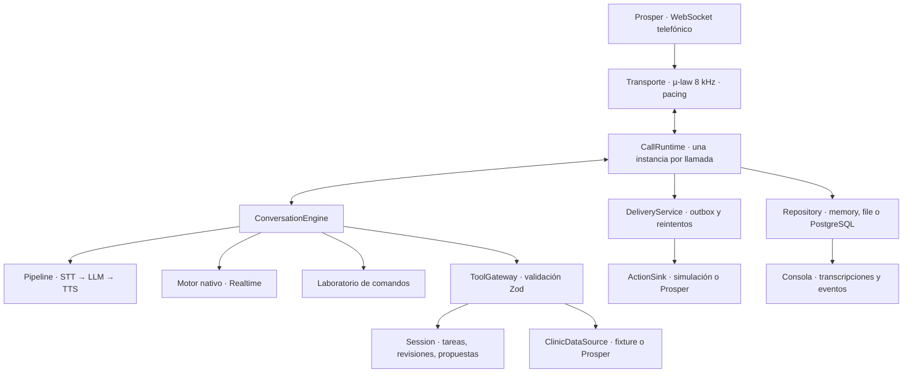

# Arquitectura del POC

## Decisión central

Construimos un monolito modular con puertos y adaptadores. Un solo proceso es fácil de arrancar, depurar y demostrar durante el hackathon. Los límites internos permiten sustituir proveedores y extraer servicios cuando haya una razón medida para hacerlo. Añadir microservicios ahora no haría al agente más correcto.

La conversación entiende y explica. La aplicación valida y decide qué puede convertirse en una acción. Un proveedor no recibe acceso directo al endpoint de entrega.

## Límites concretos

| Módulo | Responsabilidad | Qué puede sustituirse |
| --- | --- | --- |
| `contracts` | Tipos, validadores y puertos compartidos | Versionar contratos deliberadamente |
| `domain` | Estado de una gestión, restricciones temporales y confirmación | Reglas sin dependencia de proveedores |
| `application` | Herramientas y acceso validado a datos | Nuevos casos de uso |
| `conversation` | Bucle de herramientas y coordinación STT/modelo/TTS | Turn detection, modelo, recognizer, synthesizer |
| `runtime` | Ciclo de llamada, eventos y entrega | Política de persistencia/entrega |
| `adapters` | Protocolos externos y serialización | Voz, clínica, transporte, almacenamiento |
| `apps/server` | Composición, configuración y HTTP/WebSocket | Infraestructura de ejecución |
| `apps/console` | Inspección del comportamiento real | UI independiente del proveedor |
| `evaluation` | Escenarios reproducibles del sistema | Ampliar corpus y métricas |

Los módulos son carpetas en un único proyecto TypeScript, no paquetes publicados. No hace falta un framework de inyección: los constructores reciben interfaces. El `engineFactory` crea un motor nuevo por llamada, nunca una instancia de conversación compartida.

## Dos formas diferentes de voz

**Pipeline.** `SpeechRecognizer` emite transcripciones parciales y finales. `TurnDetector` decide interrupción y turno. `LanguageModel` devuelve texto o llamadas de herramientas. `SpeechSynthesizer` devuelve un iterable de audio. Puedes cambiar ElevenLabs por otro proveedor implementando el mismo puerto, con conversión explícita si no acepta el formato telefónico.

**Nativo.** `ConversationEngine` controla una sesión de voz a voz y normaliza sus eventos a `EngineHost`. No obligamos a Realtime a fingir que tiene un STT, LLM y TTS independientes. Este es también el límite para un futuro GPT-Live, Gemini Live o un servicio de voz gestionado.

Ambos invocan las mismas herramientas. El motor declara formatos, idiomas y capacidades. El runtime rechaza audio incompatible. No hay cambio automático de proveedor a mitad de llamada: migrar contexto, audio oído y herramientas pendientes requiere un protocolo de recuperación que este POC no implementa.

Los idiomas declarados son objetivos de integración, no resultados de evaluación acústica. Debemos medir castellano, catalán y cada idioma adicional requerido antes de prometer cobertura.

## Una reserva de principio a fin

1. El transporte obtiene el `call_id` de `start.callSid`, crea la sesión y fija el motor.
2. El agente crea una tarea e identifica al paciente mediante dos campos. Una búsqueda ambigua no verifica a nadie; cambiar la identificación invalida la anterior.
3. Se guardan preferencias estructuradas. Fechas ISO, ventana máxima de 14 días, zona Europe/Madrid. La interpretación de «el jueves que viene» sigue a cargo del modelo.
4. La herramienta consulta disponibilidad real. Descarta hoy, ubicaciones/proveedores fuera de preferencias y periodos incompatibles. No genera slots nuevos.
5. El agente elige un slot devuelto y una póliza declarada y aceptada. Para cancelar/mover se comprueba la cita pendiente del paciente.
6. La aplicación crea una propuesta con ID, revisión, acción exacta y resumen. El agente debe leer el resumen íntegro.
7. En un turno posterior, una confirmación explícita valida esa propuesta. «Sí, pero por la tarde» no cuenta como confirmación. Cambiar preferencias elimina la propuesta anterior.
8. Al cerrar, se persisten y entregan las acciones confirmadas. Cada una tiene un hash estable de llamada y contenido. Se reintentan errores transitorios con el mismo contenido hasta el plazo del contrato.

Las negativas y escaladas son acciones explícitas y no exigen confirmación de reserva. Los motivos de restricciones necesitan evidencia de la API; `no_availability` requiere una búsqueda vacía. Otros motivos, incluyendo la clasificación de emergencia, siguen dependiendo de la interpretación del motor: no son una garantía médica.

Varias gestiones en una llamada se representan con tareas separadas. Un resultado asíncrono lleva la revisión con la que empezó: si el usuario cambió preferencias mientras llegaba la disponibilidad, se descarta.

## Interrupciones y entrega

Prosper no procesa `clear`. `PacedAudio` envía fragmentos de 20 ms y deja de sacar audio pendiente cuando se interrumpe. Esto reduce el audio que ya no podemos retirar. No sabemos con precisión cuánto llegó a escuchar el interlocutor: se aproxima con bytes enviados y ritmo local.

El pipeline solo marca el resumen como presentado cuando termina de enviar su audio. Realtime espera el envío pendiente antes de registrar la transcripción de salida y usa truncado de contexto al interrumpir. El VAD del pipeline es básico: cualquier transcripción parcial interrumpe. Aún hace falta medir ruido, falsos cortes y carreras de eventos del proveedor.

La entrega va después del cierre porque Prosper acumula acciones y no permite retractarlas. Así, cambiar de idea dentro de la llamada puede invalidar la propuesta sin haber enviado una acción irreversible al evaluador.

El outbox se guarda antes de enviar. `200` significa recibido, `409` duplicado esperado, `410` caducado, otros 4xx rechazado. Los fallos de red, 429 y 5xx permanecen pendientes. No enviamos `NO_ACTION` para ocultar un fallo técnico.

## Persistencia y escala

`memory` sirve para pruebas. `file` guarda eventos y outbox en un fichero mediante renombrado atómico, pensado para desarrollo de **un solo proceso**. `postgres` cambia el almacenamiento, pero por sí solo no vuelve distribuido al sistema.

Antes de múltiples réplicas necesitamos:

- Propiedad exclusiva de llamada y heartbeats; evitar que dos procesos acepten el mismo `callSid`.
- Outbox con columnas e índices dedicados, transacciones y reclamación mediante lease / `FOR UPDATE SKIP LOCKED`. El adaptador actual usa JSONB y no ofrece exclusión entre workers.
- Persistencia transaccional de propuesta confirmada + outbox, política de recuperación de llamadas interrumpidas y reconciliación. Hoy se recupera un outbox ya preparado; no se reconstruye una llamada activa tras una caída.
- Retención y paginación de eventos; hoy la consola consulta cada 1,5 s y el repositorio carga el registro completo. Reemplazar por consultas incrementales/SSE cuando el volumen lo justifique.
- Límites globales por proveedor, backpressure medido, métricas de latencia y pruebas de carga con voz real. El límite de 20 sesiones no acredita que la infraestructura o la cuota de proveedores soporten 20 conversaciones acústicas.

El diseño permite crecer, pero este POC no se anuncia como producción distribuida ni ofrece entrega exactamente una vez. La deduplicación del receptor ayuda con reintentos; no sustituye las transacciones locales.

## Cómo añadir piezas

**Otro STT:** implementar `SpeechRecognizer`, normalizar parciales/finales, comprobar codecs y añadir tests de desconexión. Registrarlo en el composition root.

**Otro LLM:** implementar `LanguageModel`, traducir mensajes y herramientas dentro del adaptador, validar salidas y soportar `AbortSignal`. No cambiar `ToolGateway`.

**Otro TTS:** implementar `SpeechSynthesizer`, producir audio etiquetado, cancelar el stream cuando se aborta y evitar buffers ilimitados.

**GPT-Live u otro motor nativo:** implementar `ConversationEngine` y llamar a `EngineHost.tool`. Normalizar interrupción, transcripción, contexto y cierre; añadir pruebas de contrato específicas. Realtime y GPT-Live no comparten necesariamente eventos ni modelos.

**Otra clínica:** implementar `ClinicDataSource` y `ActionSink`; mapear IDs, reglas, disponibilidad y acciones. La clínica real puede requerir transacciones/reservas de slots que Prosper no necesita por ser un sandbox de lecturas.

**Otro transporte:** envolver el runtime con audio y ciclo de vida normalizados. No llevar tipos Twilio al dominio.

## Orden recomendado para continuar

1. Validar una llamada real de cada motor: formatos, modelo/voz accesibles, saludo, tool calling, cierre y recibo.
2. Añadir escenarios para los 18 problemas: autorizaciones familiares, nuevos pacientes, negativas por reglas, cambios múltiples, fechas vagas, idiomas y ataques. Comparar acciones exactas con casos públicos, manteniendo las respuestas fuera del runtime.
3. Mejorar experiencia: resúmenes localizados y legibles, verificación por nombre + nacimiento con desambiguación, historial clínico y datos de caller ID tratados solo como pistas.
4. Medir y optimizar latencia: streaming de texto, TTS por cláusulas, VAD/interrupciones, backchannels y trazas por fase.
5. Endurecer recuperación, privacidad y operación; después evaluar despliegue con réplicas.

## Fuentes de integración

- [Contrato Prosper archivado](../task/contract.md) y [OpenAPI](../task/openapi.json).
- [OpenAI: conversaciones Realtime](https://developers.openai.com/api/docs/guides/realtime-conversations).
- [ElevenLabs: STT](https://elevenlabs.io/docs/api-reference/speech-to-text/v-1-speech-to-text-realtime) y [TTS WebSocket](https://elevenlabs.io/docs/api-reference/text-to-dialogue/ttd-websocket).

Los adaptadores están implementados contra esos contratos, pero necesitan pruebas con credenciales para comprobar disponibilidad de cuenta, comportamiento y calidad final.

### Idiomas de conversación (revisión 19 septiembre 2026)

La cobertura de la aplicación es inglés, español y catalán (`en`, `es`, `ca`),
coincidiendo con las propuestas localizadas y el problema 11 documentado en
`task/problems.md`. Esa copia incluye cambios de idioma durante la llamada.
No es una afirmación de que ElevenLabs solo soporte esos tres idiomas.

Scribe v2 Realtime recibe `language_code=es` y `secondary_languages=en,ca`
(parámetros repetidos en WebSocket). La referencia oficial documenta que esto
limita el conjunto considerado en la identificación:
https://elevenlabs.io/docs/api-reference/speech-to-text/v-1-speech-to-text-realtime

Las etiquetas ISO 639-3 se normalizan, las no soportadas se descartan y los
fragmentos cortos o con números no modifican la pista de idioma. La pista es
orientativa: la petición explícita y el texto claro del usuario tienen prioridad.
La política del modelo restringe las respuestas a esos tres idiomas y pide elegir
uno cuando se solicita otro; no bloquea cambios voluntarios entre ellos. La
restricción STT no garantiza detectar correctamente habla fuera del conjunto.
La salida del LLM está limitada mediante instrucciones, no mediante un detector
independiente que valide cada frase antes del TTS.

Eleven v3 incluye español, inglés y catalán en su lista oficial; también gallego,
pero no se ha ampliado aquí la cobertura funcional a gallego. No se encontró
confirmación de euskera en esta lista:
https://elevenlabs.io/docs/help-center/other/what-languages-do-you-support
