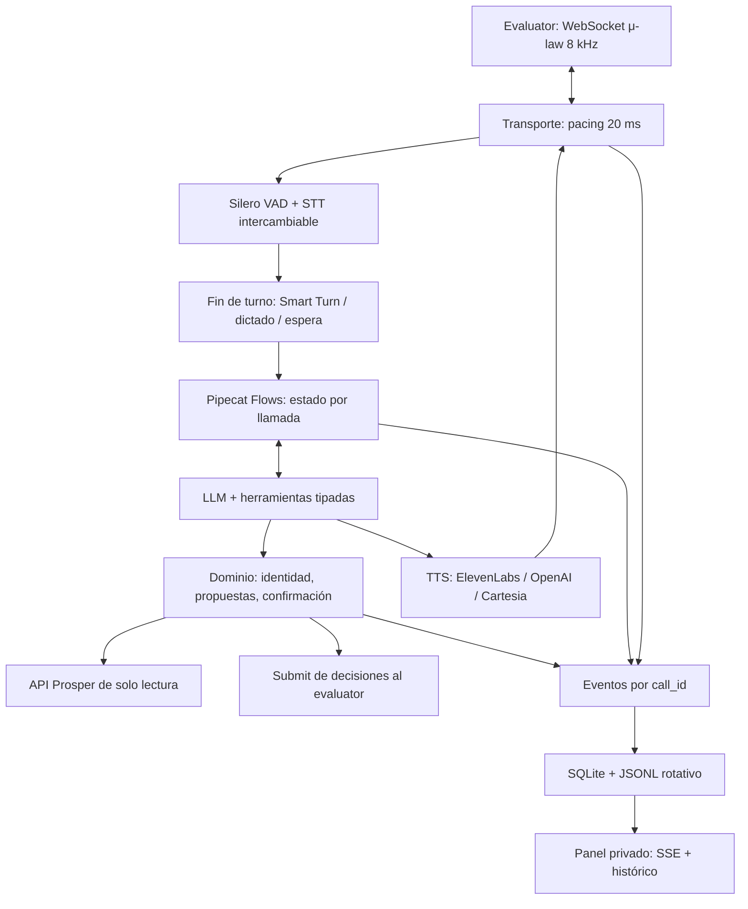

# Python voice v1

## Qué cambia

Base funcional: `feature/lucia-work`, commit `37d4a32`. Esta rama conserva únicamente el nuevo sistema Python y su panel web: se han retirado el backend TypeScript, sus tests, scripts y configuración npm. La implementación anterior se puede consultar o recuperar desde aquella rama o el historial de Git. No se modifica ningún agente remoto de ElevenLabs.



### Módulos

```text
src/clinic_voice/
  app.py                  FastAPI, autenticación, lifecycle y límite de llamadas
  settings.py             Configuración validada; secretos no imprimibles
  voice/
    pipeline.py           Pipeline por llamada, cancelación y eventos de voz
    providers.py          Adaptadores STT / LLM / TTS
    transport.py          Wire protocol del evaluator, cierre sin cuenta Twilio
    turns.py              Smart Turn y perfiles de silencio
    observer.py           Latencias, errores, métricas e interrupciones
  conversation/
    flow.py               Nodos y herramientas; schemas generados de firmas tipadas
    prompts.py            Política de recepción y contexto por fase
  domain/state.py         Estado, propuestas, validaciones y vocabulario de motivos
  application/tools.py    Casos de uso y guardas de negocio independientes del LLM
  integrations/
    prosper.py            HTTP instrumentado; lectura y submit
    geocoder.py           Photon, caché y límite de peticiones para cercanía
  infrastructure/
    events.py             Eventos durables, redacción, SQLite y JSONL
    sdk_logging.py        Warnings/errores del framework correlacionados por llamada
  console/                HTML/CSS/JS sin build ni framework frontend
tests/                    Reglas, transporte, concurrencia, logs y pipeline local
```

## Flujo de ejecución

1. El socket se autentica, reserva capacidad y valida `start`. `start.callSid` es la fuente de verdad de `call_id`, no `customParameters.call_id`.
2. Se crea estado aislado, cliente HTTP y pipeline. El catálogo se obtiene una vez por proceso. Los servicios de voz tienen estado independiente por llamada.
3. Audio entrante se convierte a PCM; Silero detecta voz. STT transcribe; Smart Turn estima si la frase ha terminado. El dictado espera 1,6 segundos y «espera un momento» 8 segundos; son valores iniciales a medir.
4. El LLM pide herramientas. La aplicación verifica un paciente por nombre + segundo identificador aportado en la conversación; caller ID no basta. Las respuestas al modelo excluyen DNI, teléfono y fecha de nacimiento del directorio.
5. Availability entrega referencias locales a slots reales, con tipo de cita y póliza. Se filtra fecha, mañana/tarde, día de semana e idioma solicitado; las restricciones de edad, historia, derivación y cobertura las resuelve la API autoritativa.
6. `prepare_action` construye una propuesta. No escribe. El asistente debe pronunciarla, esperar otro turno y recibir un asentimiento inequívoco. Una corrección invalida la propuesta y requiere volver a buscar/preparar.
7. `commit_action` envía el payload exacto. Se distingue aceptado, rechazado y resultado desconocido. Se deduplican operaciones idénticas en la llamada. Cancelaciones o interrupciones del modelo no cancelan un submit ya iniciado; se espera su resultado hasta 20 segundos al cerrar.
8. Se comunica el resultado real y se permite continuar con otra acción/paciente. No se limita a una acción por llamada. Un cierre sin registro produce `call.missing_record`, nunca un resultado inventado.

Los motivos de escalado y la interpretación de preferencias siguen dependiendo del LLM; no se presentan como reglas infalibles. Las guardas evitan ciertos errores estructurales, no sustituyen los tests conversacionales.

### Interrupciones y audio

- Sin filtro de entrada, sin cancelación de ruido. OpenAI STT se configura con `noise_reduction=None`; el VAD detecta actividad, **no limpia el audio**.
- Pipecat cancela la generación/reproducción pendiente ante una interrupción. Una propuesta interrumpida no se considera pronunciada por completo.
- Salida troceada y temporizada en bloques de 20 ms. El evaluator documenta que `clear` actualmente no vacía su audio ya recibido; no se promete retirar audio que salió del servidor.
- La confirmación usa una estimación del transporte, no un acuse de reproducción del interlocutor. Eso y el comportamiento con ruido real deben medirse con llamadas del evaluator.
- La confirmación es conservadora: una respuesta ambigua o un identificador que no puede asociarse a la transcripción requieren aclaración. Fechas dictadas totalmente en palabras y ciertos idiomas pueden necesitar repetición.

## Configuración

| Variable | Uso / valor inicial |
|---|---|
| `PLATFORM_API_KEY`, `PLATFORM_API_BASE_URL` | API clínica/evaluator |
| `OPENAI_API_KEY` | LLM y STT por defecto |
| `LLM_MODEL` | `gpt-4.1-mini`; admite `OPENAI_TEXT_MODEL` como alias de configuración |
| `OPENAI_BASE_URL` | Endpoint del LLM compatible con OpenAI; no cambia STT/TTS |
| `STT_PROVIDER` | `openai` o `deepgram` |
| `STT_MODEL` | Vacío selecciona `gpt-4o-transcribe` o `nova-3` |
| `DEEPGRAM_API_KEY` | Solo si STT usa Deepgram |
| `TTS_PROVIDER` | `elevenlabs`, `openai` o `cartesia` |
| `TTS_MODEL` | Vacío selecciona `eleven_flash_v2_5`, `gpt-4o-mini-tts` o `sonic-3` |
| `ELEVENLABS_API_KEY`, `ELEVENLABS_VOICE_ID` | Solo síntesis; ningún `AGENT_ID` necesario |
| `CARTESIA_API_KEY`, `CARTESIA_VOICE_ID` | Solo si TTS usa Cartesia |
| `OPENAI_VOICE` | `coral` si TTS usa OpenAI |
| `CONSOLE_TOKEN` | Obligatorio para acceder a los datos del panel |
| `TRANSPORT_TOKEN` | Bearer del socket; configurar también en el evaluator |
| `SMART_TURN_ENABLED` | `true`; `false` usa silencio de 0,6 s |
| `CLOCK_MODE` | `lucia_9am` preserva el anclaje observado en el baseline; `call_date` sigue literalmente la fecha de llamada |
| `MAX_CALLS` | 24; pruebas de aislamiento con 20 sockets simultáneos |
| `CALL_TIMEOUT_SECONDS` | 200 |
| `DATA_DIR` | `data/voice` |
| `LOG_TRANSCRIPTS` | `true`; `false` oculta eventos de transcripción, no garantiza eliminar PII de argumentos/resultados |
| `GEOCODER_URL` | Photon público; recibe la dirección para calcular cercanía, nunca el resto de la ficha |

Los modelos son valores iniciales configurables, no una afirmación de superioridad ni de menor coste demostrado. La calidad lingüística depende del modelo y voz elegidos: probar español, catalán, inglés, euskera y gallego. Cambiar una variable no garantiza igual cobertura.

La cuenta y las claves de un proveedor pueden no tener acceso a un modelo o voz. `/ready` solo comprueba presencia de configuración; no hace peticiones de facturación ni certifica permisos. El panel informa de credenciales ausentes sin exponer sus valores.

## Panel y diagnóstico

`/console` muestra llamadas activas/finalizadas, número de acciones y errores; al seleccionar una llamada, su línea temporal incluye:

- Transcripciones (si habilitadas), cambios de flujo y perfil de escucha.
- `tool.started/completed/failed`, argumentos, resultados, duración y `tool_id`.
- `api.started/completed/failed`, método, ruta, estado, intento, duración y `request_id`.
- `operation.started/accepted/rejected/unknown`, identificador estable de operación y recibo.
- Errores con tipo y stack; warnings/errores del SDK con componente y `call_id`.
- Audio, interrupciones, métricas de proveedores y latencia desde turno de usuario a primer audio.

El panel usa SSE autenticado mediante `fetch`, con cursor y reconexión; la lista de llamadas se refresca cada 2 segundos. Permite filtrar y exportar eventos de una llamada. Histórico limitado en UI a 200 llamadas y 6.000 eventos por llamada; la base mantiene todo.

Archivos: `DATA_DIR/events.sqlite3` (WAL) y `events.jsonl` (10 MB + 5 rotaciones). Al reiniciar se marcan como interrumpidas las llamadas que quedaron abiertas. No se reanudan sockets ni submits automáticamente.

**Privacidad:** se ocultan secretos, DNI, teléfono, fecha de nacimiento y email en campos estructurados y patrones comunes en texto. No es anonimización completa: nombres, notas, direcciones y datos dictados en palabras pueden permanecer. Tratar la carpeta como información sensible; no subirla a Git, no publicar el panel sin HTTPS/token, definir retención antes de usar datos reales. No se guardan audios. La consola almacena el token solo en `sessionStorage`, nunca en la URL.

**Diagnóstico rápido:**

1. Mirar `/health` y `/ready`; revisar proveedor/credenciales en el panel.
2. Filtrar por `call_id`, después «Errores». Seguir `tool_id`, `request_id` y `operation_id`.
3. `422` es rechazo de payload; `404/410` suele ser call ID/plazo; `429/5xx` o timeout en submit deja resultado incierto. No anunciar éxito ni repetir a ciegas.
4. `operation.accepted` significa que Prosper admitió la entrega, **no que el caso haya aprobado**. La puntuación se consulta en el evaluator.
5. `call.missing_record` no equivale a `no-action`: hay que inspeccionar el diálogo y resolver la causa.

## Ejecución y despliegue

Python 3.11, dependencias fijadas por `uv.lock`. No requiere Node.js ni npm; el JavaScript del panel se ejecuta exclusivamente en el navegador. Un único proceso de Uvicorn; no usar `--workers 2` con este almacén/registro en memoria. Persistir `DATA_DIR` y elegir un puerto libre.

```bash
uv sync --python 3.11 --frozen
uv run uvicorn clinic_voice.app:app --host 0.0.0.0 --port 7860 --workers 1
```

Docker opcional:

```bash
docker build -f Dockerfile.voice -t clinic-voice .
docker run --env-file .env -p 7860:7860 -v clinic-voice-data:/app/data/voice clinic-voice
```

El arranque de la primera llamada incluye inicialización de modelos locales. Para carga real hay que medir CPU/RAM con Smart Turn y proveedores en paralelo; la prueba de 20 sockets no es un benchmark de 20 inferencias simultáneas. Photon público está limitado/cachéado dentro del proceso; para uso sostenido hace falta servicio propio o contratado.

## Validación antes de reemplazar a Lucía

1. `uv run pytest -q`: pruebas offline con API/proveedores simulados; también ejecutan transporte, VAD, Flows y pipeline Pipecat reales con audio local.
2. `uv run ruff check src/clinic_voice tests`.
3. Llamada sintética con proveedores reales y catálogo real, sin modificar configuración remota ni enviar decisiones inventadas.
4. Registrar nuevo endpoint en un entorno de prueba y ejecutar los casos públicos: identidad, dictado, correcciones, cambios de idioma, interrupciones, seguro alternativo, dos acciones y paciente distinto.
5. Comparar baseline vs Python: aciertos por caso, errores de transcripción, falsos cortes, latencia p50/p95, tiempo de herramientas y coste por llamada. No cambiar el endpoint principal hasta demostrar paridad.

No se incluye una promesa de pasar todos los casos ni una migración automática de prompts/configuración remota. La implementación se basa en las reglas y ficheros versionados de la rama; configuraciones solo presentes en la cuenta de ElevenLabs necesitan exportación para una comparación exacta.

Smoke opcional de proveedores: `RUN_LIVE_VOICE_SMOKE=1 uv run pytest tests/test_live_voice.py -q -s`. Usa las claves de `.env` y genera un saludo (facturable), con Smart Turn real; bloquea por completo cualquier petición a Prosper. Verifica conexión/generación de audio, no comprensión de conversación ni puntuación del evaluator.

### Verificado en esta entrega (19 septiembre 2026)

- 37 pruebas Python offline superadas; smoke facturable excluido por defecto.
- Smoke real OpenAI + ElevenLabs + Smart Turn superado: primer audio en 4,96 s incluyendo arranque en frío. No es un benchmark de latencia conversacional.
- Ruff, compilación Python y revisión visual del panel con eventos simulados: correctos.
- Pendientes: Docker en entorno Linux, carga de inferencia concurrente y batería conversacional del evaluator.
